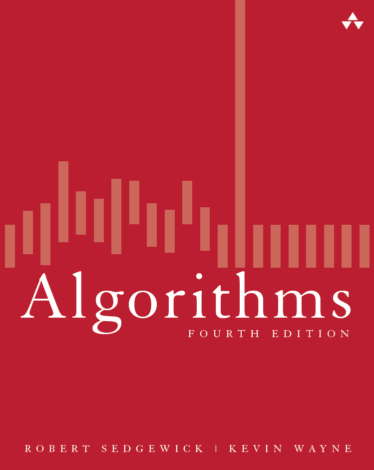

# Algorithms
Solutions to the exercises of the Algorithms book by Robert Sedgewick and Kevin Wayne (4th editon).

I found the book to be an excellent resource to learning algorithms and data structures. Since there are not many (almost none) solutions of the exercises on the Internet and the only ones available are incomplete, I decided to share my work on the exercises. Hopefully this will help students and professionals to validate their exercise solutions and learn more about the book content.

To the best of my knowledge, these solutions are correct. 
If you find anything incorrect feel free to create an issue or to open a pull request. 

Many of these exercises are used as homework assignments in universities. If you have to do any of these exercises as homework make sure you understand the problem and solution instead of simply copying it. Understanding these algorithms and data structures will be extremelly valuable in your career.

The exercises answered on this repository are based on the seventh printing of the book (of September 2015).
Other printings of the book (especially older ones) may have exercises in a slightly different order.

<b>Update (November 26 2018):</b> 
It took me 2 and a half years of work, but the repository is now complete! 
You can now find here the solutions to all the exercises in the book.
